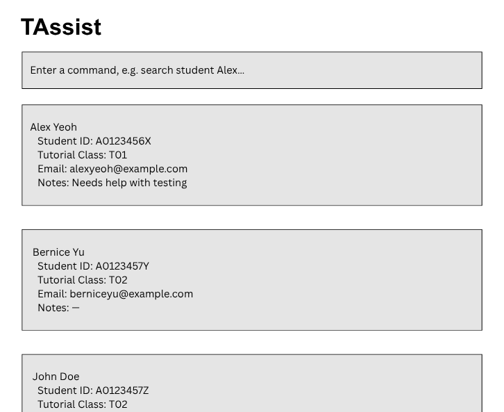

# TAssist

[](https://github.com/AY2627S1-CS2103-F11-1/tp/actions/workflows/gradle.yml)


## Introduction

TAssist is designed for university teaching assistants teaching computing modules with at least one multi-week coding project.

With many students, potentially from different tutorial classes, TAs may not be able to remember each individual student’s progress. By tracking metrics like attendance, deliverables, key design decisions, and personal details like past interactions, TAs will be able to assess their progress and offer or initiate contextualized support more efficiently.

## Features

- Manage student records across different tutorial classes
- Record student information and personal notes
- Search for students by name or student ID
- Track project deliverables and completion statuses
- Record students’ project progress and design decisions
- Add, edit and delete notes about students’ project work
- Use commands to perform actions efficiently

## Example Commands

```text
view students
search /name John Doe
search /id A1234567Z
add student /name John Doe /id A1234567Z /email johndoe@u.nus.edu /class 7 /notes abc
edit student /id A1234567Z /name John Tan /class T07
delete /id A1245678Z 
init course /course CS2103T /sem AY26/27-S1 /task v1.1, v1.2, MVP, PE-D, Final Demo
add context John Doe /note Used Task as Parent class of ToDo and Deadline
view progress /course CS2103T /sem AY26/27-S1
mark /id A1234567Z /task Milestone 1
unmark /name John /task job1, job2
```

## Acknowledgements
* This project is based on the `AddressBook Level 3` project created by the [SE-EDU initiative](https://se-education.org) and the code template can be found [here](https://github.com/se-edu/addressbook-level3)
* This project is a **part of the se-education.org** initiative. If you would like to contribute code to this project, see [se-education.org](https://se-education.org/#contributing-to-se-edu) for more info.