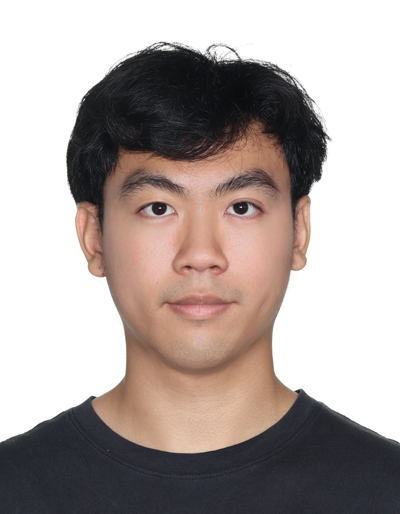
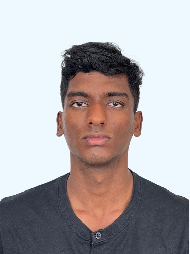
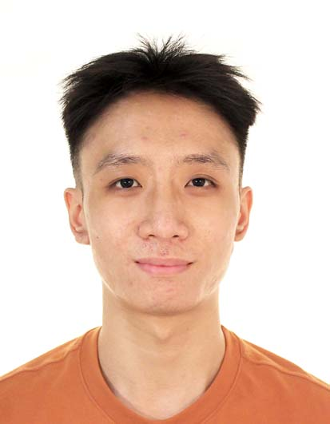

We are a team based in the [School of Computing, National University of Singapore](https://www.comp.nus.edu.sg).

You can reach us at the email `seer[at]comp.nus.edu.sg`

## Project team

### Kevin Tan Shin Wei

[[github](https://github.com/mizzfain)]

* Role: Developer
* Responsibilities: Project Direction
* 
### Goh Min Rui

[[github](https://github.com/minrui13)]

* Role: Developer

### Piyaphat Klanprayoon

[[github](https://github.com/piyaphat38030)]

- Role: Developer
- Responsibilities: Documentation

### Johnny Doe

[[github](http://github.com/johndoe)] [[portfolio](team/johndoe.md)]

- Role: Developer
- Responsibilities: Data

### Jean Doe

[[github](http://github.com/johndoe)]
[[portfolio](team/johndoe.md)]

- Role: Developer
- Responsibilities: Dev Ops + Threading

### Arun Baskaran

[[github](https://github.com/arun-bas)]

- Role: Developer
- Responsibilities: UI

### Indra Bachtiar

[[github](http://github.com/indraarr)]

- Role: Developer
